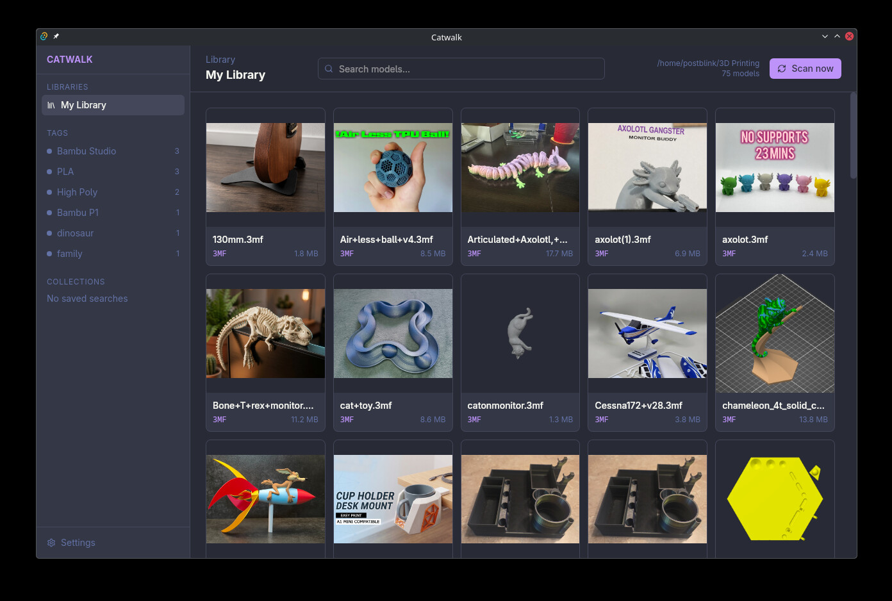
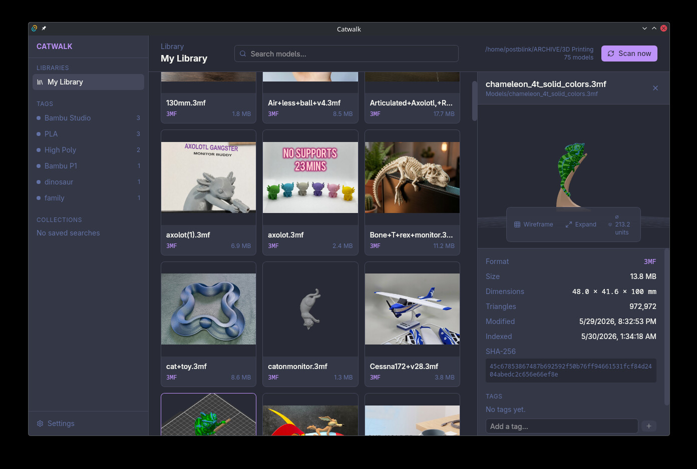

# Catwalk

Organize the 3D-printing model files you already have. Catwalk indexes your folders in place — it never moves, renames, or edits a single file — and gives you a searchable, taggable library with a real 3D viewer.

Built with Tauri 2, SvelteKit, Svelte 5, Threlte, and Rust.



> **Status:** First public release. Scan, browse, preview, tag, and search all work end to end. Unsigned builds for macOS, Linux, and Windows are on the [releases page](../../releases). Because the builds are unsigned, macOS Gatekeeper and Windows SmartScreen will warn you on first launch — the release notes explain how to get past it. This is early software. Bug reports are wanted.

## Why

Model files accumulate across drives, downloads, and slicer exports. There's no good way to see what's actually inside them without opening each one. Catwalk reads your existing folders where they already are, renders every model, and lets you tag and filter until the pile is findable.

## What it does

- **Real 3D viewer.** STL, OBJ, and 3MF render in an interactive viewer — orbit, pan, zoom, wireframe toggle, fullscreen popout. 3MF multicolor (painted faces, color groups, base materials) shows up the way your slicer painted it.
- **Fast by default.** Parsing runs in a Web Worker, decoded geometry is cached to disk, and the library warms in the background after a scan. Models open instantly, not just the ones you've already clicked.
- **Smart organization.** Manual tags plus auto-tags inferred from slicer metadata and filenames. Search and filter the grid, save filters as smart collections, bulk-tag with multi-select.
- **Slicer-aware.** 3MF projects from Bambu Studio, OrcaSlicer, PrusaSlicer, and Cura contribute their embedded preview, print time, layer height, and nozzle settings.
- **Non-destructive.** Catwalk indexes your folders. It never moves, renames, or modifies your files.
- **Cross-platform.** macOS, Linux, and Windows. No Electron.



## Formats

| Format | Indexed | Metadata | Thumbnail | 3D preview |
| --- | --- | --- | --- | --- |
| STL | yes | — | rendered | yes |
| OBJ | yes | — | rendered | yes |
| 3MF | yes | Bambu / Orca / Prusa / Cura | embedded | yes (multicolor) |
| G-code | yes | planned | planned | planned |
| STEP / STP | planned | — | — | planned |

## Installing

Grab the installer for your platform from the [releases page](../../releases). Builds are **unsigned**, so your OS will warn you the first time — that's expected, not a sign anything's wrong. Here's how to get past it:

**macOS** — open the `.dmg` (`aarch64` for Apple Silicon, `x64` for Intel) and drag Catwalk to Applications. On first launch, right-click the app and choose **Open → Open** to bypass Gatekeeper. If it still refuses, clear the quarantine flag:

```sh
xattr -dr com.apple.quarantine /Applications/Catwalk.app
```

**Windows** — run the `.exe` (or `.msi`). SmartScreen may show "Windows protected your PC"; click **More info → Run anyway**.

**Linux** — use the package for your distro:

```sh
chmod +x Catwalk_*.AppImage && ./Catwalk_*.AppImage   # AppImage (any distro)
sudo apt install ./Catwalk_*.deb                       # Debian / Ubuntu
sudo dnf install ./Catwalk-*.rpm                        # Fedora / RHEL
```

## Feedback

This is early software. If something breaks or feels off, please [open an issue](../../issues) and include your OS and what you were doing.

## Development

Prerequisites: Rust (stable), Node.js 20+, pnpm.

```sh
pnpm install
pnpm tauri dev
```

Common scripts:

```sh
pnpm test        # run the Vitest suite
pnpm build       # build the SvelteKit front end
pnpm tauri build # build a desktop bundle for your platform
```

> On Linux, the `tauri` script sets `WEBKIT_DISABLE_DMABUF_RENDERER=1` and
> `WEBKIT_DISABLE_COMPOSITING_MODE=1` to work around a WebKitGTK + GBM
> rendering crash seen on many distros. These are no-ops on macOS and Windows.

## License

[AGPL-3.0-or-later](./LICENSE). If you run a modified version of Catwalk as a network service, you must offer its source to your users.
